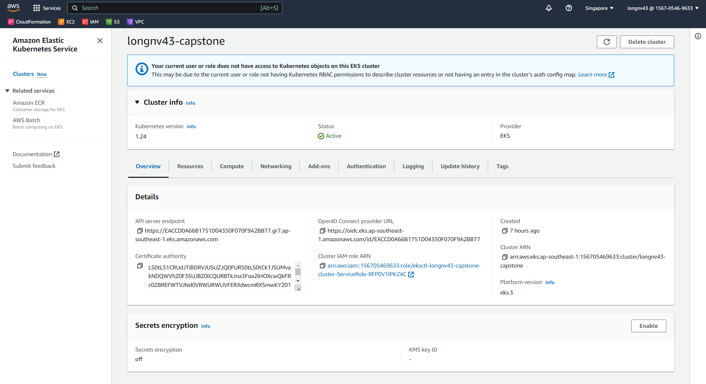

# Udacity Cloud DevOps Engineer - Capstone Project 

[](https://app.circleci.com/pipelines/github/nvlong17/devops-capstone)

## Steps in Completing Your Project
### Step 1: Propose and Scope the Project
    Plan what your pipeline will look like.
    Decide which options you will include in your Continuous Integration phase. Use either Circle CI or Jenkins.
    Pick a deployment type - either rolling deployment or blue/green deployment.
    For the Docker application you can either use an application which you come up with, or use an open-source application pulled from the Internet, or if you have no idea, you can use an Nginx “Hello World, my name is (student name)” application.

- [x] Docker application: Flask app at `app.py`
- [x] Rolling Deployment type
- [x] Continuous Integration using Circle CI
- [x] Plan what the pipeline will look like

Pipeline steps:
- Install dependencies
- Lint the application with `hadolint`
- Build a docker image
- Push the docker image to AWS Elastic Container Registry (ECR)
- Deploy Kubernetes using AWS Elastic Kubernetes Service (EKS)

### Step 2: Use CircleCI, and implement blue/green or rolling deployment. 
    Set up your CircleCI account and connect your git repository.
    Set up your environment to which you will deploy code.

- [x] Git repository connected to CircleCI
- [x] Setup environment variables for CircleCI:
    - AWS_ACCESS_KEY_ID
    - AWS_SECRET_ACCESS_KEY
    - AWS_ACCOUNT_ID
    - AWS_DEFAULT_REGION
    - AWS_ECR_REGISTRY_ID
    - ECR_REPO_NAME

### Step 3: Pick AWS Kubernetes as a Service, or build your own Kubernetes cluster.
    Use Ansible or CloudFormation to build your “infrastructure”; i.e., the Kubernetes Cluster.
    It should create the EC2 instances (if you are building your own), set the correct networking settings, and deploy software to these instances.
    As a final step, the Kubernetes cluster will need to be initialized. The Kubernetes cluster initialization can either be done by hand, or with Ansible/Cloudformation at the student’s discretion.

- [x] Use AWS Elastic Kubernetes Service (EKS) for provisioning a Kubernetes cluster.

Used `eksctl` with the following command to deploy an EKS cluster:
```
eksctl create cluster \
    --name longnv43-capstone \
    --version 1.24 \
    --nodegroup-name standard-workers \
    --node-type t3.medium \
    --nodes 1 \
    --nodes-min 1 \
    --nodes-max 2 \
    --region ap-southeast-1 \
    --zones ap-southeast-1a \
    --zones ap-southeast-1b \
    --zones ap-southeast-1c
```
#### EKS Cluster


#### CloudFormation stacks for EKS


#### EC2 Instance for EKS node


### Step 4: Build your pipeline
    Construct your pipeline in your GitHub repository.
    Set up all the steps that your pipeline will include.
    Configure a deployment pipeline.
    Include your Dockerfile/source code in the Git repository.
    Include with your Linting step both a failed Linting screenshot and a successful Linting screenshot to show the Linter working properly.

- [x] Pipeline in [GitHub repository](https://github.com/nvlong17/devops-capstone)
- [x] Set up all the steps that your pipeline will include.
- [x] Deployment pipeline at [CircleCI Config](.circleci/config.yml)
- [x] Include your Dockerfile/source code in the Git repository.
- [x] Include with your Linting step both a failed Linting screenshot and a successful Linting screenshot to show the Linter working properly.

#### Linting
Failed lint

Passed lint


### Step 5: Test your pipeline
    Perform builds on your pipeline.
    Verify that your pipeline works as you designed it.
    Take a screenshot of the Circle CI or Jenkins pipeline showing deployment, and a screenshot of your AWS EC2 page showing the newly created (for blue/green) or modified (for rolling) instances. Make sure you name your instances differently between blue and green deployments.

#### Container image repository


#### Pipeline builds


#### Deployments to Kubernetes cluster
Initial deployment

Updated deployment
